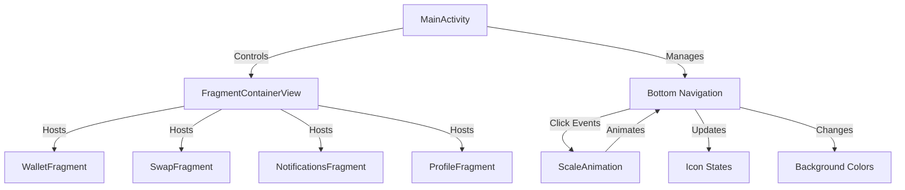

# 🎨 Animated Bottom Navigation View

<div align="center">


**A production-ready Android application showcasing modern UI/UX patterns with fluid animations, fragment-based architecture, and Material Design 3 principles.**

[Features](#-key-features) • [Demo](#-demo) • [Architecture](#-architecture) • [Installation](#-getting-started) 

---

### ⭐ Star this repository if you find it helpful!

</div>

---

## 🎬 Demo

<div align="center">

### Live Application Preview


*Experience smooth transitions and dynamic animations in action*

</div>

### 📹 Demo Highlights

| Feature | Description |
|---------|-------------|
| 🎯 **Smooth Transitions** | Fragment switching with zero lag |
| 🎨 **Color Morphing** | Dynamic color changes per section |
| ⚡ **Scale Animations** | Elegant 0.8x → 1.0x scaling effect |
| 🎪 **Icon States** | Automatic icon swapping on selection |

---

## ✨ Key Features

<table>
<tr>
<td width="50%">

### 🎯 Core Functionality
- ✅ **Single Activity Architecture** — Optimized memory management
- ✅ **Fragment-Based Navigation** — Modular and maintainable
- ✅ **Animated State Transitions** — 500ms smooth animations
- ✅ **Dynamic UI Updates** — Real-time icon & background changes
- ✅ **Edge-to-Edge Display** — Immersive full-screen experience
- ✅ **Memory Efficient** — No activity stack overhead

</td>
<td width="50%">

### 🎨 Design Excellence
- ✅ **Material Design 3** — Latest design standards
- ✅ **Custom Vector Icons** — 8 handcrafted SVG icons
- ✅ **Color-Coded Sections** — Intuitive visual hierarchy
- ✅ **Pill-Shaped Indicators** — Modern rounded corners
- ✅ **Elevated Components** — Subtle shadow effects
- ✅ **Responsive Layouts** — Adapts to all screen sizes

</td>
</tr>
</table>

### 🔧 Technical Highlights

```java
// Advanced Features Implementation
✓ ScaleAnimation with custom interpolators
✓ FragmentManager transaction optimization
✓ WindowInsetsCompat for edge-to-edge
✓ ViewCompat for backward compatibility
✓ Gradle Kotlin DSL configuration
✓ ProGuard rules for release optimization
```

---

## 🏗️ Architecture

### Project Structure

```
AnimatedBottomNavigationView/
│
├── 📱 app/
│   ├── 🔧 build.gradle.kts              # Modern Gradle configuration
│   ├── 🛡️ proguard-rules.pro            # Release optimization rules
│   │
│   └── 📂 src/
│       ├── 🎯 main/
│       │   ├── 📄 AndroidManifest.xml
│       │   │
│       │   ├── ☕ java/com/example/animatedbottomnavigationview/
│       │   │   ├── MainActivity.java           # 🎮 Navigation controller
│       │   │   ├── WalletFragment.java         # 💰 Wallet screen
│       │   │   ├── swapFragment.java           # 🔄 Swap screen
│       │   │   ├── notificationsFragment.java  # 🔔 Notifications screen
│       │   │   └── profileFragment.java        # 👤 Profile screen
│       │   │
│       │   └── 🎨 res/
│       │       ├── 🖼️ drawable/
│       │       │   ├── wallet.xml & wallet_selected.xml
│       │       │   ├── swap.xml & swap_selected.xml
│       │       │   ├── notifications.xml & notifications_selected.xml
│       │       │   ├── profile.xml & profile_selected.xml
│       │       │   └── round_back_*.xml        # Background shapes
│       │       │
│       │       ├── 📐 layout/
│       │       │   ├── activity_main.xml       # Main container
│       │       │   └── fragment_*.xml          # Screen layouts
│       │       │
│       │       ├── 🎨 values/
│       │       │   ├── colors.xml              # Color palette
│       │       │   ├── strings.xml             # Text resources
│       │       │   └── themes.xml              # App theming
│       │       │
│       │       └── 📋 xml/
│       │           ├── backup_rules.xml
│       │           └── data_extraction_rules.xml
│       │
│       ├── 🧪 androidTest/                    # Instrumentation tests
│       │   └── ExampleInstrumentedTest.java
│       │
│       └── ✅ test/                            # Unit tests
│           └── ExampleUnitTest.java
│
├── 🔨 gradle/                                 # Gradle wrapper
├── ⚙️ build.gradle.kts                        # Root build config
├── 📝 settings.gradle.kts                     # Module settings
└── 📖 README.md                               # Documentation
```

### Component Interaction Flow



---

## 🚀 Getting Started

### 📋 Prerequisites

Before you begin, ensure you have the following installed:

| Requirement | Version | Download Link |
|-------------|---------|---------------|
| **Android Studio** | Arctic Fox+ | [Download](https://developer.android.com/studio) |
| **JDK** | 11 or higher | [Download](https://www.oracle.com/java/technologies/downloads/) |
| **Gradle** | 7.0+ | Auto-installed with Android Studio |
| **Android SDK** | API 24+ | Android Studio SDK Manager |
| **Git** | Latest | [Download](https://git-scm.com/downloads) |

### 📥 Installation

#### Step 1: Clone the Repository

```bash
# Using HTTPS
git clone https://github.com/Meesum-Afzaal/animated-bottom-navigation.git

# Or using SSH
git clone git@github.com:Meesum-Afzaal/animated-bottom-navigation.git

# Navigate to project directory
cd animated-bottom-navigation
```

#### Step 2: Open in Android Studio

1. Launch **Android Studio**
2. Click **File** → **Open**
3. Navigate to the cloned directory
4. Select the project root folder
5. Click **OK**

#### Step 3: Sync Dependencies

```bash
# Android Studio will automatically prompt you to sync
# Or manually trigger sync:
# Click "Sync Now" in the notification bar
# Or File → Sync Project with Gradle Files
```

#### Step 4: Build the Project

```bash
# Using Android Studio
# Click Build → Make Project (Ctrl+F9 / Cmd+F9)

# Or using command line
./gradlew build
```

#### Step 5: Run the Application

```bash
# Connect an Android device via USB with USB Debugging enabled
# Or start an Android Emulator (AVD)

# Run from Android Studio
# Click Run (Shift+F10 / Ctrl+R)

# Or using command line
./gradlew installDebug
```

### 🔍 Verification

After installation, you should see:
- ✅ App launches successfully
- ✅ Bottom navigation bar displays
- ✅ Wallet fragment loads by default
- ✅ Smooth animations on tab switching

---

---

## 🛠️ Tech Stack & Dependencies

### Core Technologies

<div align="center">

| Category | Technology | Version | Purpose |
|----------|-----------|---------|---------|
| **Language** |  | 11 | Primary language |
| **UI Framework** |  | - | Layout design |
| **Build System** |  | 8.0 | Dependency management |
| **Architecture** |  | Latest | Modern components |
| **Design** |  | 1.11.0 | UI guidelines |

</div>

### Dependencies

```kotlin
dependencies {
    // AndroidX Core
    implementation("androidx.appcompat:appcompat:1.6.1")
    implementation("androidx.activity:activity:1.8.2")
    implementation("androidx.constraintlayout:constraintlayout:2.1.4")
    
    // Material Design
    implementation("com.google.android.material:material:1.11.0")
    
    // Fragment Navigation
    implementation("androidx.fragment:fragment:1.6.2")
    
    // Testing
    testImplementation("junit:junit:4.13.2")
    androidTestImplementation("androidx.test.ext:junit:1.1.5")
    androidTestImplementation("androidx.test.espresso:espresso-core:3.5.1")
}
```

### Build Configuration

```kotlin
android {
    namespace = "com.example.animatedbottomnavigationview"
    compileSdk = 35
    
    defaultConfig {
        applicationId = "com.example.animatedbottomnavigationview"
        minSdk = 24       // Android 7.0 Nougat
        targetSdk = 34    // Android 14
        versionCode = 1
        versionName = "1.0"
    }
    
    compileOptions {
        sourceCompatibility = JavaVersion.VERSION_11
        targetCompatibility = JavaVersion.VERSION_11
    }
}
```

---

## 👨‍💻 Author

<div align="center">

### **Meesum Afzaal**

[](https://www.linkedin.com/in/meesum-afzaal-85ba21355)
[](https://github.com/Meesum-Afzaal)
